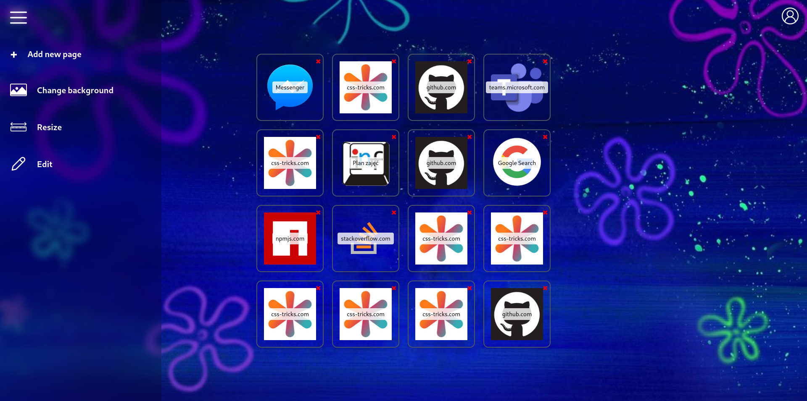
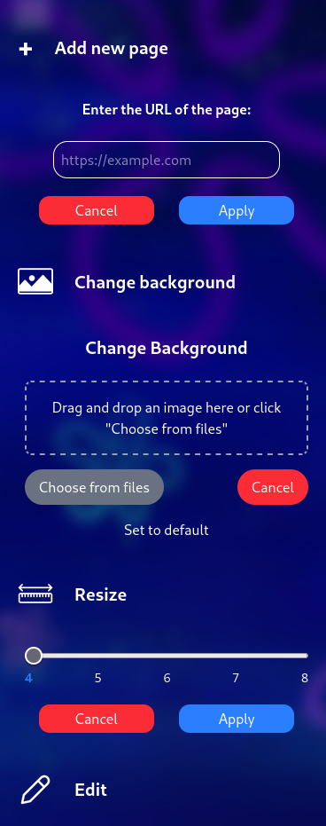

# Bookmarks

A modern, customizable bookmark manager built with React and Vite. Organize your favorite web pages in a visually appealing, drag-and-drop tile interface. Personalize your experience with custom backgrounds, adjustable grid layouts, and easy-to-use navigation.

## Features

- **Tile-based Bookmark Dashboard:**  
  Add, edit, and delete bookmarks as tiles. Drag and drop to rearrange them.

- **Customizable Layout:**  
  Change the number of columns to resize your dashboard using the built-in slider.

- **Background Personalization:**  
  Upload your own background image or reset to default for a unique look.

- **Favicon & Title Fetching:**  
  Each bookmark displays the website's favicon and title for easy identification.

- **User Authentication Pages:**  
  Includes simple Login and Register pages (UI only, no backend).

- **Modern Stack:**  
  - React for UI  
  - Tailwind CSS for styling  
  - [react-dnd](https://react-dnd.github.io/react-dnd/about) for drag-and-drop

## Project Structure

- `src/components/` — Reusable UI components (Navbar, Tiles, Draggable, etc.)
- `src/pages/` — Main app pages (TilePage, LoginPage, RegisterPage)
- `src/utils/` — Utility files (e.g., drag-and-drop item types)
- `src/assets/` and `src/icons/` — Images and icons
- `src/styles/` — Custom CSS (e.g., shake animation)
- `public/` — Static assets

## Edit

## Menu

